  


<!-- TOC start -->
- [What is the problem we are solving ... and how?](#what-is-the-problem-we-are-solving-and-how)
- [GRAPH FOR BETTER KNOWLEDGE LINKING](#graph-for-better-knowledge-linking)
- [Overview](#overview)
  * [Introduction:](#introduction)
  * [What is the challenge?](#what-is-the-challenge)
  * [What particular problem do we address?](#what-particular-problem-do-we-address)
- [GeoQB Architecture Overview](#geoqb-architecture-overview)
- [Datamodel](#datamodel)
  * [GeoQB Layer Factory](#geoqb-layer-factory)
- [How to use this package?](#how-to-use-this-package)
  * [Preparation](#preparation)
  * [How to use the CLI?](#how-to-use-the-cli)
  * [How to run the examples?](#how-to-run-the-examples)
    + [0. Setup the graph database with OSM-Graph structure.](#0-setup-the-graph-database-with-osm-graph-structure)
    + [1. Populate the graph database with OSM data from Sophox.](#1-populate-the-graph-database-with-osm-data-from-sophox)
    + [2. Load the graph layers from our cloud based OSM data graph.](#2-load-the-graph-layers-from-our-cloud-based-osm-data-graph)
    + [3. Additional data enrichent.](#3-additional-data-enrichent)
    + [4. Populate the graph database with OSM data from Open-Streetmap-API.](#4-populate-the-graph-database-with-osm-data-from-open-streetmap-api)
    + [X. Apply the Node2Vec algorithm.](#x-apply-the-node2vec-algorithm)
- [How to manage a workspace?](#how-to-manage-a-workspace)
- [Analysis Results](#analysis-results)
- [Project Story](#project-story)
  * [Inspiration](#inspiration)
  * [What it does](#what-it-does)
  * [How we built it](#how-we-built-it)
  * [Challenges we ran into](#challenges-we-ran-into)
    + [Challenge 1 ###](#challenge-1-)
    + [Challenge 2 ###](#challenge-2-)
    + [Challenge 3 ###](#challenge-3-)
    + [Challenge 4 ###](#challenge-4-)
  * [Accomplishments that we're proud of](#accomplishments-that-were-proud-of)
  * [What we learned](#what-we-learned)
  * [What's next for GeoQB](#whats-next-for-geoqb)
- [Resources:](#resources)
<!-- TOC end -->

<!-- TOC --><a name="what-is-the-problem-we-are-solving-and-how"></a>
# What is the problem we are solving ... and how?
We focus on solving a data integration problem, not by providing just another data processing pipeline, but rather by introducing
a methodology which allows us to provide contextualized data assets in a form which fits ideally into the scalable graph database: TigerGraph.

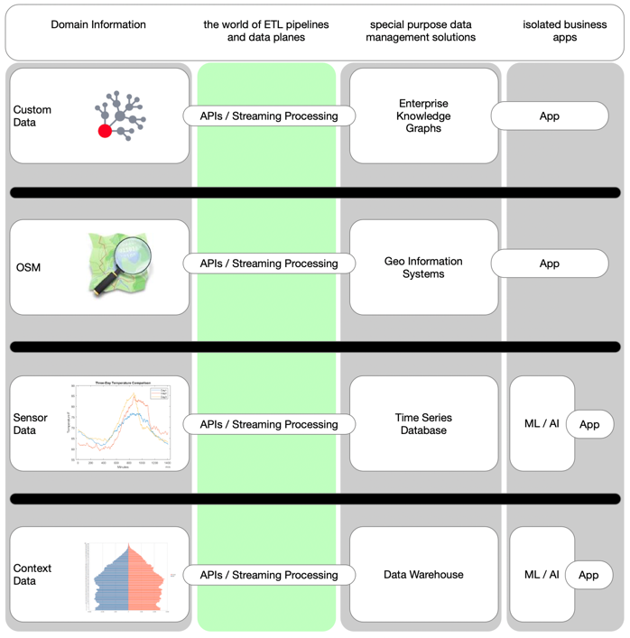

The core concept for our work is named _managed graph layer_.
Layers are defined by metadata exposed with public datasets, or by queries.
Sparql queries are used to read data from public triples stores, and Overpass QL is used to query the Oberpass API for OpenStreetmap data.
The data layers will be staged, indexed and integrated in a unified analysis data model, which is managed in the TigerGraph platform.


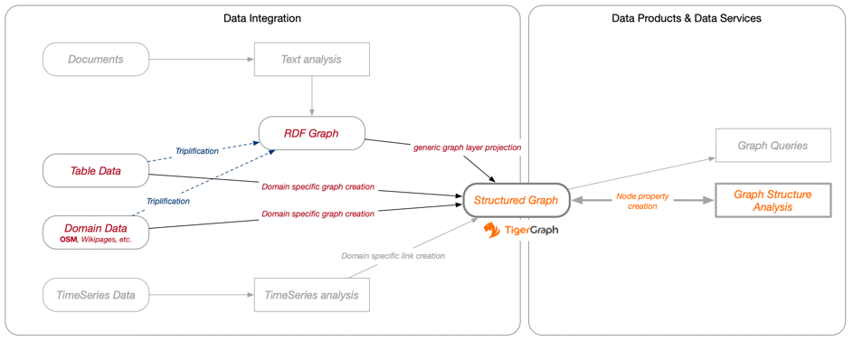

Such a managed graph layer represents a particular aspect from a particular knowledge domain.
Multiple of them can easily be integrated by using custom indexing methods, such as geo-spatial indexing.
Managed graph layers can be exposed via APIs, public service endpoints, or in public data pods, such as the SOLID pod.

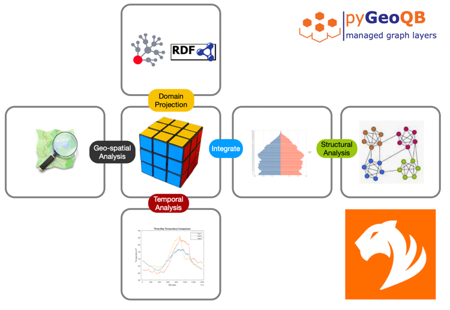

Using Pandas, R, or Tensorflow together with graph based data integration methods becomes as easy as baking a cake.

Our package pyGeoQB provides an example solution for handling _managed graph layers_ in the context of sustainability analysis.

We submitted the pyGeoQB project to the _Graph-FOR-All_ hackathon as a self defined challenge:

<!-- TOC --><a name="graph-for-better-knowledge-linking"></a>
# GRAPH FOR BETTER KNOWLEDGE LINKING
X: Next Generation Knowledge management to showcase personal decision support for maintaining a sustainable life style

---
<!-- TOC --><a name="overview"></a>
# Overview
Our pyGeoQB package has been created during the [_Graph-FOR-All hackathon_](https://devpost.com/software/geoqb).
* A presentation about this work has been accepted by the Knowledge Graph Conference (NYC, KGC2022)
  and will be presented online in May 2022.

<!-- TOC --><a name="introduction"></a>
## Introduction:

With the Green Deal in Europe and other initiatives to integrate sustainability in our lifestyle, we often struggle with how we can be more sustainable and even more if our surroundings are allowing us to be.

What is the problem, or class of problems?

One of the choices we make is the place where we live, i.e., when we buy a property, we are looking at a lot of factors that can guide us whether the surroundings fit our needs. Unfortunately, not every relevant aspect is present in an expose nor is the data accessible easily.

We have to combine lots of different knowledge bases to create a more holistic understanding before we are able to apply interesting analysis algorithms which then help us to find answers to important questions which matter in real life.

The field of data science and data engineering has been growing in the last two decades from single computer applications to scalable cloud-based solutions. Special purpose databases and analytics engines appeared. Those solve many classes of important problems, such as data lake management on scalable clusters with storage, and compute capabilities, real-time streaming data integration, API based system integration, just to name the most obvious.

Technical standardization is ongoing, and unified tool support many projects on multiple levels, i.e., the data import and export across data centers and access to streaming data across continents are well supported by robust open protocols and enterprise ready data management solutions. Reliable exchange of files, messages, events, or database records is not a big problem any longer, due to the progress in  recent technologies on which we can build our systems upon.

But the integration of data models from multiple domains is still a non-trivial task.
Ontologies have been developed to express the knowledge models of existing systems,
Knowledge graphs are in the focus of many projects, products, and start-ups.

But how can we combine all those knowledge spread across many graphs in such a way that allows us for a flexible information management and data analysis, using ML and AI systems, without becoming an export in all the related domains?

Or in short: How can we link data from multiple sources very efficiently to prepare the input for advanced spatial analysis, combined with time-series analysis, structural analysis, and NLP?

<!-- TOC --><a name="what-is-the-challenge"></a>
## What is the challenge?

Many well specialized data analysis platforms do exist. And most of them have their special optimized data structures and data representations, which typically match their goals best.

The overarching data model we consider is a property graph. Using nodes and edges with specific attributes allows us to represent a variety of data structures, managed in "special purpose data management solutions". Staging the data in a scalable graph database can be a solution which simplifies the information integration processes across organizations, enterprises, and individuals.

<!-- TOC --><a name="what-particular-problem-do-we-address"></a>
## What particular problem do we address?

In order to get a better understanding of the surroundings of a property or the place we visit on a trip we might be interested in how sustainable life in this location could be. We know the projects OpenStreetmap, and Wikidata. In theory, we could start digging in the public data using cloud based systems.

But this is far away from convenient information retrieval and requires a lot of expertise in the OSM and Wikidata data domains. It rather is a data science and data engineering exercise. It includes using multiple knowledge sources which must be combined technically, and logically so that the contained facts are related to each other in a reliable and meaningful way.

Assume a simple and reusable load operation for the graph database, which maps the raw data into a knowledge model. With this we can establish scalable integrated graph layers, to represent a variety of reusable data models which all fit particular use cases.

We would be interested in investigating individual aspect of, let’s say, sustainability related facts in a particular layer on its own, or any combinations of them. And by adding variable personal preferences to the data structures, we would be able to feed a powerful analytics engine which helps us to understand the interaction of several aspects, represented as graph layers, and to cater to the needs of an individual, a community, or the society. The most important aspect of such an approach would be it’s ability to provide personalized results, rather than just generic maps which are sometimes hard to interprete.

Such a model could help in the future local communities better define needs to become more sustainable. It could become a good decision support for individuals to where they want to settle down or offer the missing services, needed by a sustainable community.


<!-- TOC --><a name="geoqb-architecture-overview"></a>
# GeoQB Architecture Overview
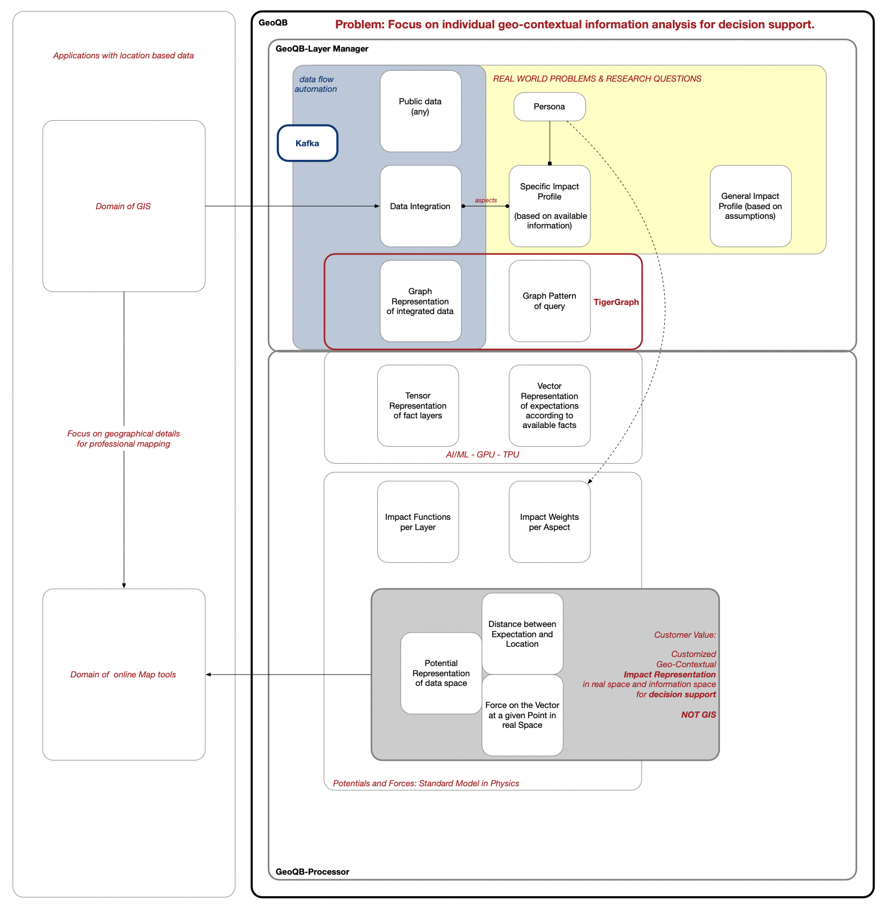

<!-- TOC --><a name="datamodel"></a>
# Datamodel

Based on the OSM data we collect via OverPass API or Sophox Sparql endpoint we have
created the following datamodel:

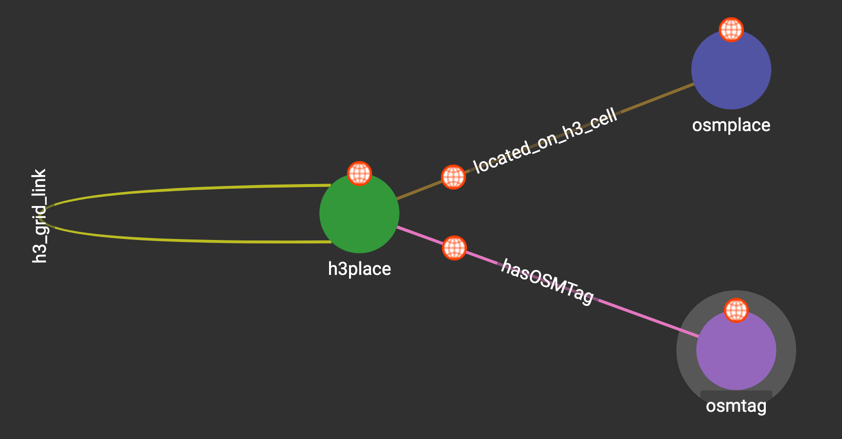

Blending more facts into the datamodel can be done in a systematic way.
Some facts are relevant for all layers, hence we add them tp the h3-cells
using a generic link with the observed value and timestamp as link attribute.

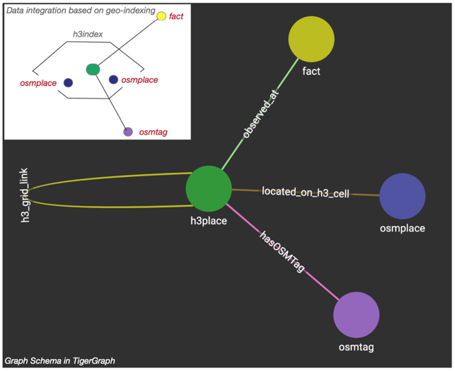

The layer-id attribute is used to manage the multilayer aspects of the graph we construct for our analysis szenario.

<!-- TOC --><a name="geoqb-layer-factory"></a>
## GeoQB Layer Factory
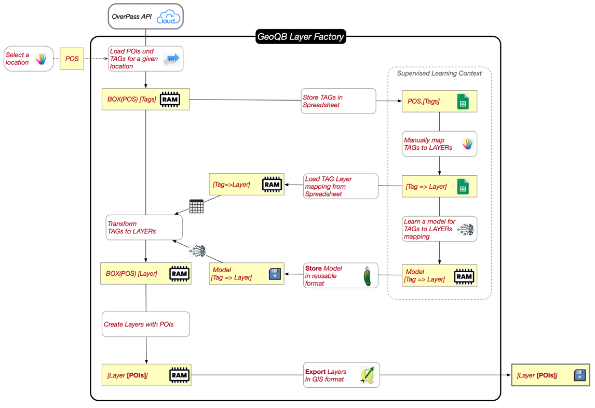

<!-- TOC --><a name="how-to-use-this-package"></a>
# How to use this package?

The __examples__ folder contains several demo script.

The __script__ folder contains some scripts to prepare the environment.

---
<!-- TOC --><a name="preparation"></a>
## Preparation
Before you execute the examples you need a working TigerGraph application.

The credentials for your TigerGraph applications will be configured in the _env.sh_ file in the _bin_ folder.

The following variables must be defined in your _env.sh_ file.
``` 
#!/bin/bash

source $1/bin/activate

### WORKSPACE path
#
# path must end with /
#
export GEOQB_WORKSPACE=/Users/mkaempf/GITHUB.private/geoqb-playground/KGC-2022/

### Overpass-API service - public OSM data service
export overpass_endpoint="https://overpass.kumi.systems/api/interpreter"

### Sophox - public OSM-RDF data service
export sophox_endpoint='https://sophox.org:443/sparql'

### TigerGraph cloud
export TG_URL=https://geoqb.i.tgcloud.io/
export TG_SECRET_ALIAS=...
export TG_SECRET=...
export TG_PASSWORD=...
export TG_USERNAME=...

### Tebi S3 - via boto3
export aws_access_key_id='...',
export aws_secret_access_key='...',
export s3_endpoint_url='https://s3.tebi.io'

### SOLID Cloud Data-POD
export SOLID_IDP='https://solidcommunity.net'
export SOLID_POD_ENDPOINT="https://xxx.solidcommunity.net"
export SOLID_USERNAME="..."
export SOLID_PASSWORD="...#"

### Confluent Cloud - Kafka
export bootstrap_servers="..."
export security_protocol="SASL_SSL"
export sasl_mechanisms="PLAIN"
export sasl_username="..."
export sasl_password="..."

# Confluent Cloud - Schema Registry
export schema_registry_url="..."
export basic_auth_credentials_source="USER_INFO"
export basic_auth_user_info="...:..."
``` 
<!-- TOC --><a name="how-to-use-the-cli"></a>
## How to use the CLI?

The initial set of CLI tools contains:

- **gqws** : for managing the workspace
- **gql** : for managing and processing layers
- **gqblend** : for simplified data blending

Additional tools for _linking to remote assets_ and for _graph query management_ are work in progress.

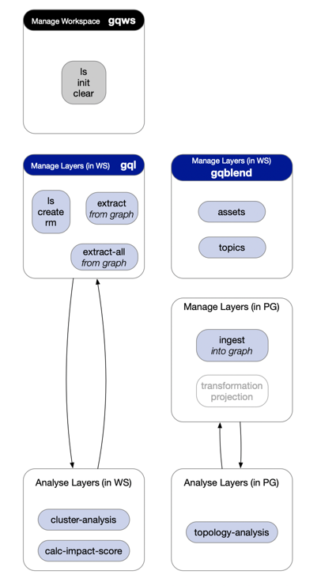

<!-- TOC --><a name="how-to-run-the-examples"></a>
## How to run the examples?

<!-- TOC --><a name="0-setup-the-graph-database-with-osm-graph-structure"></a>
### 0. Setup the graph database with OSM-Graph structure.
``` 
source ./env/env.sh; python examples/test_szenario_0.py
```

<!-- TOC --><a name="1-populate-the-graph-database-with-osm-data-from-sophox"></a>
### 1. Populate the graph database with OSM data from Sophox.
``` 
source ./env/env.sh; python examples/test_szenario_1.py
source ./env/env.sh; python examples/test_szenario_1a.py
```

<!-- TOC --><a name="2-load-the-graph-layers-from-our-cloud-based-osm-data-graph"></a>
### 2. Load the graph layers from our cloud based OSM data graph.
``` 
source ./env/env.sh; python examples/test_szenario_1d.py
```

<!-- TOC --><a name="3-additional-data-enrichent"></a>
### 3. Additional data enrichent.
``` 
source ./env/env.sh; python examples/test_szenario_2.py
```

<!-- TOC --><a name="4-populate-the-graph-database-with-osm-data-from-open-streetmap-api"></a>
### 4. Populate the graph database with OSM data from Open-Streetmap-API.
``` 
source ./env/env.sh; python examples/test_szenario_2.py
```

<!-- TOC --><a name="x-apply-the-node2vec-algorithm"></a>
### X. Apply the Node2Vec algorithm.
``` 
source ./env/env.sh; python examples/test_graph_analysis_4.py
```


<!-- TOC --><a name="how-to-manage-a-workspace"></a>
# How to manage a workspace?

The GeoQB-workspace is a local folder in which all data files are persisted.
Such data is, e.g., responses from data providers, downloaded files, generated temporary data assets,
so that we can reuse previous responses efficiently.
This way we reduce the load on external services and we increase the speed of our development work.

You can configure the *GEOQB_WORKSPACE* variable in your _env.sh_ file. Point it to a temporary folder, to a shared drive, or to a locally available cloud storage volume.
```
### WORKSPACE path
export GEOQB_WORKSPACE=/Users/mkaempf/GITHUB.private/geoqb-playground/KGC-2022)
```

Support for using _SOLID-Pods_ for sharing your data asset in a well controlled manner is on the way and will be added soon.

[](https://github.com/GeoQB/geoqb-playground)

GeoQB playground is a Github based data pod with example data used in our hackathon project.

<!-- TOC --><a name="analysis-results"></a>
# Analysis Results

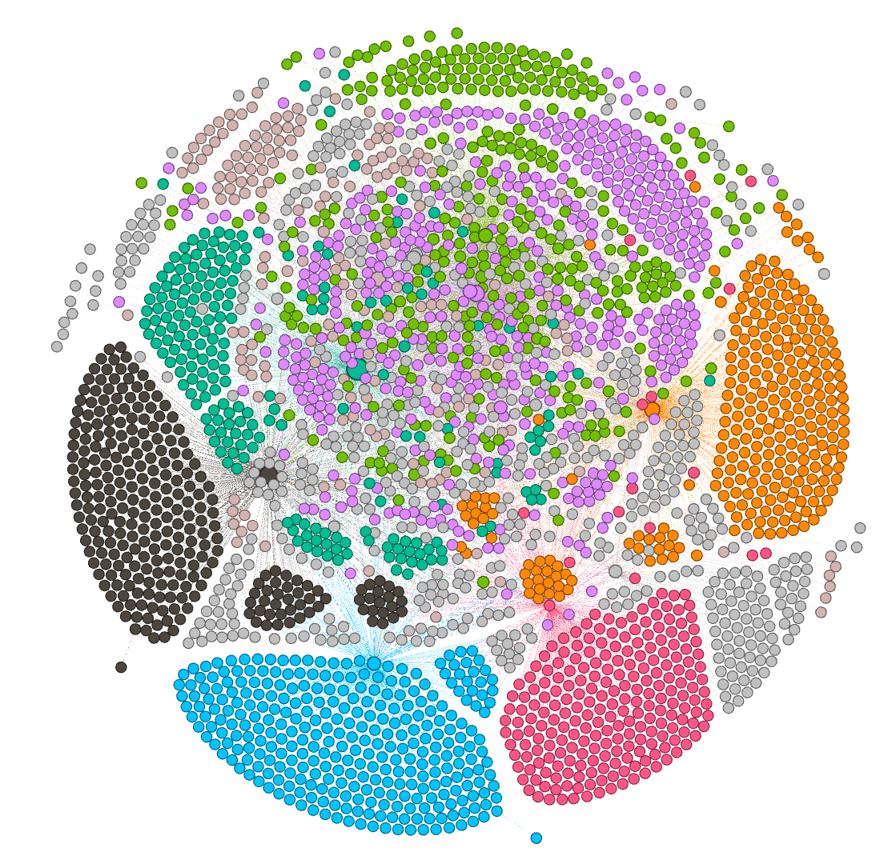

How isolated or how well mixed individual aspectes are, is shown in the above image.


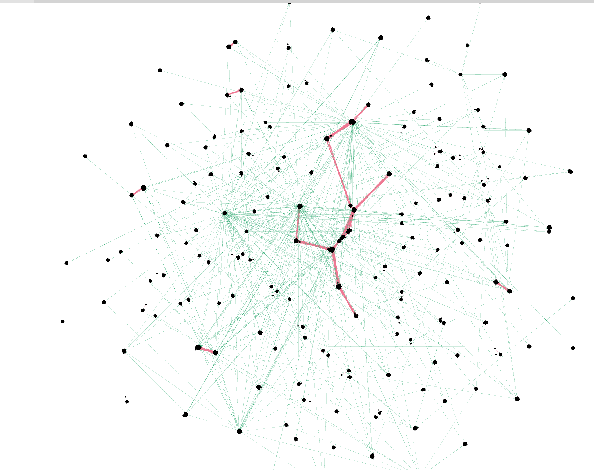

This figure highlghts the "backbone" of the graph which represents the problem domains.

----

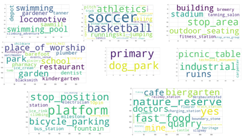

Word clouds reveal which "items" can be found within a close neighborhood.

-------
<!-- TOC --><a name="project-story"></a>
# Project Story

<!-- TOC --><a name="inspiration"></a>
## Inspiration
In 2015 we have developed a method to measure the 'representation index' of topics in Wikipedia. Wikipedia has been used as a proxy to study human interaction with complex technical systems. Since then, I was hooked to the idea, of merging arbitrary public data in a geo-context. Creating a personalized map which represents either the geo-local representation of facts & things or even better, their impact on my personal profile became my goal - but without studying GIS systems, and Ontology design using OWL and RDF it was a hard challenge. We decided to develop a proper graph based data model on top of TigerGraph.

There is another element of inspiration to our project: Terraform.
What Terraform is for managing cloud infrastructure, GeoQB is for multi-layer graph data management.

<!-- TOC --><a name="what-it-does"></a>
## What it does
pyGeoQB is used to manage multiple graph layers from a variety of sources, using "layer definition queries". We keep the metadata in a data pod - so the date can be shared easily. Initially using local folders, or Github based versioned data pods. Support for **SOLID data pods** will come soon!.

<!-- TOC --><a name="how-we-built-it"></a>
## How we built it
The initial version is a Python package for Python3. No active service is needed. This allows you using it in your own applications, e.g., in Flask applications, or in Jupyther notebooks, or in Google Collaborate.

<!-- TOC --><a name="challenges-we-ran-into"></a>
## Challenges we ran into
<!-- TOC --><a name="challenge-1-"></a>
### Challenge 1 ###
One challenge is the absence of standards for managing data from multiple domains. We do not intend to engineer more ontologies, but rather, we want to reuse existing ontologies and hence, reusing existing triple stores should become easier in the future.

<!-- TOC --><a name="challenge-2-"></a>
### Challenge 2 ###
Mapping object data and metadata into the property graph depends on information about future use-cases and expected queries. Analysis algorithms, such as k-means clustering require vectors as input, rather than edges and nodes. We have to manage the integration of RDF data, property graphs, and ML library specific formats as fluent as possible.

<!-- TOC --><a name="challenge-3-"></a>
### Challenge 3 ###
Managing complex large distributed data structures requires easy tracebility and transparency over all transformation steps. No matter what role you are in - analysts, algorithm developers, data product creators need transparency along the data processing pipelines - ideally they follow the FAIR data principles. But currently, no standards do exist.

<!-- TOC --><a name="challenge-4-"></a>
### Challenge 4 ###
Managing data updates requires a different approach - preferably, a continuous change event stream should be handled by the system, so that the modeled multi-layer graph can evolve over time. Real time data processing is crucial and will drive acceptance of future graph data applications.

<!-- TOC --><a name="accomplishments-that-were-proud-of"></a>
## Accomplishments that we're proud of
We were already able to automate the data ingestion from 3 different technical system into a multi-layer property graph, managed in a cloud based TigerGraph instance.
Using SPARQL and Overpass QL allows us to interact with a variety of public open data systems. Static data layers provided by the data for good project have been integrated. Managing the layer definition and additional domain data in a public data pod or in a Kafka topic allows us cloud native operations and to become Web3 - ready.  Users do not have to focus on managing files on their workstations, but rather utilize cloud technologies, and higher abstractions, such as the managed multi-layer graphs we provide.

<!-- TOC --><a name="what-we-learned"></a>
## What we learned
We learned a lot about using TigerGraph and pyTigerGraph. Mapping data from ER models and RDF data into the property graph data model was the most important domain we increased our experience.

Besides the improvement in the technical context, we also learned, that a lot of collaboration will be needed in the future. Data quality and a wide acceptance of public data can only win if users and providers of data come closer together. This holds for commercial systems, for public solutions used by the society, and also for research and free use-cases.

An inversion of control and active management of personal information, such as personal impact profiles, are important aspects of a data centric future. E.g., a personal impact profile allows context sensitive analysis and controlled personalization and customization of data products.

<!-- TOC --><a name="whats-next-for-geoqb"></a>
## What's next for GeoQB
With pyGeoQB we intend to provide a systematic quality analysis of available open data sources with a focus on ESG goals and sustainability information. The question is:
How can individuals know more about the sustainability aspects in their neighborhood, and it's evolution.
Missing data can be seen as an indicator of missing awareness. Once the data reaches a critical mass, also awareness will grow, and positive action my start to change the way we interact with our world, using our public data.

---
<!-- TOC --><a name="resources"></a>
# Resources:
- https://github.com/GeoQB/geoqb
- https://journals.plos.org/plosone/article/authors?id=10.1371/journal.pone.0141892
- https://www.openstreetmap.org/
- https://www.wikidata.org/wiki/Wikidata:Main_Page
- https://www.tigergraph.com/
- https://dataforgood.facebook.com/