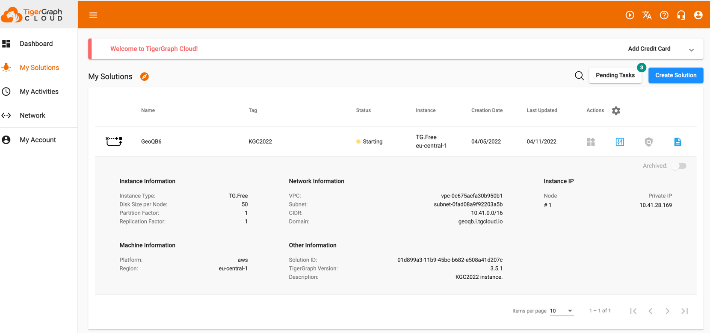
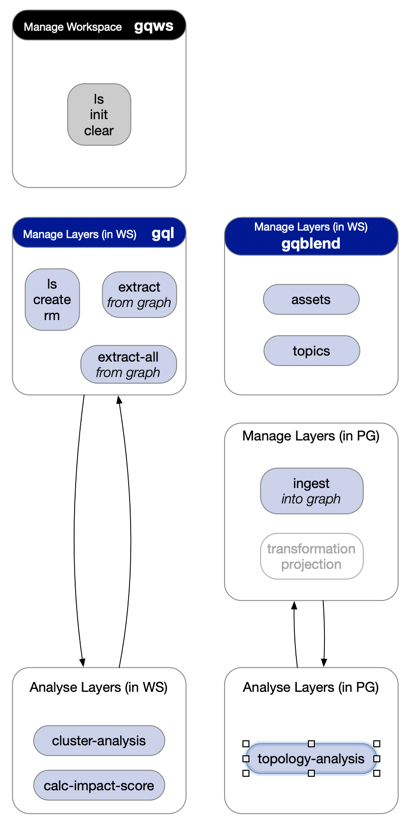

# Project Setup & Quickstart

## Step 1
Create your TigerGraph applicatin in the TigerGraph cloud.



## Step 2
Clone the pyGeoQB project.

```
git clone https://github.com/GeoQB/geoqb
```

## Step 3
Create you project data workspace. 

You can use a local folder, or even clone the playground project.
```
https://github.com/GeoQB/geoqb-playground
```

## Step 4
Create your personal _env.sh_ file with in folder _env_ within your pyGeoQB folder you just cloned.
This sensitive data will be ignored by git!

The following variables must be defined in your _env.sh_ file.
``` 
#!/bin/bash

source $1/bin/activate

### WORKSPACE path
#
# path must end with /
#
export GEOQB_WORKSPACE=/Users/mkaempf/GITHUB.private/geoqb-playground/KGC-2022/

### Overpass-API service - public OSM data service
export overpass_endpoint="https://overpass.kumi.systems/api/interpreter"

### Sophox - public OSM-RDF data service
export sophox_endpoint='https://sophox.org:443/sparql'

### TigerGraph cloud
export TG_URL=https://geoqb.i.tgcloud.io/
export TG_SECRET_ALIAS=...
export TG_SECRET=...
export TG_PASSWORD=...
export TG_USERNAME=...

### Tebi S3 - via boto3
export aws_access_key_id='...',
export aws_secret_access_key='...',
export s3_endpoint_url='https://s3.tebi.io'

### SOLID Cloud Data-POD
export SOLID_IDP='https://solidcommunity.net'
export SOLID_POD_ENDPOINT="https://xxx.solidcommunity.net"
export SOLID_USERNAME="..."
export SOLID_PASSWORD="...#"

### Confluent Cloud - Kafka
export bootstrap_servers="..."
export security_protocol="SASL_SSL"
export sasl_mechanisms="PLAIN"
export sasl_username="..."
export sasl_password="..."

# Confluent Cloud - Schema Registry
export schema_registry_url="..."
export basic_auth_credentials_source="USER_INFO"
export basic_auth_user_info="...:..."
```

## Step 5 : Setup your virtual environment and install dependencies
Using the provided **bootstrap.sh** script you create a virtual envionment.
We activate it and install the required libraries.

In the following example we use **env1** as name of our virtual environment. 

```
script/bootstrap.sh env1
```

In order to load all sensitive custom parameters in your **env.sh** file, we use the following command:

```
source env/env.sh env1; python3 examples/test_szenario_1a.py
```

This line will execute the **test_szenario1a** which is provided in the **examples** folder.

## Step 6 : Use the CLI for working with your multi-layer graph

We provide aliases for the CLI command. You can initialize those using the following shell script;

```
source script/set_aliases.sh env1
```

The figure shows you the available tools and commands.

